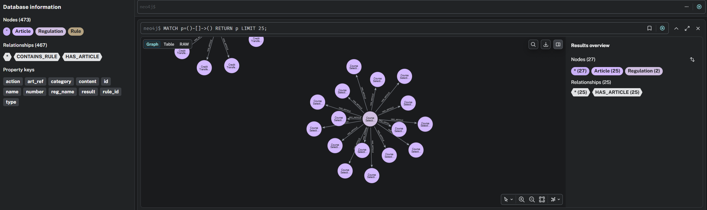

# Assignment 4: KG-based QA for NCU Regulations

**Author:** Paranchai Chianvichai (潘志凱)  
**Department:** Computer Science and Information Engineering (CSIE), National Central University

---

## 1. Project Overview
This project implements a Knowledge Graph-based Question Answering (QA) system for NCU university regulations. The system extracts legal rules from raw PDF documents, stores them in a Neo4j Knowledge Graph, and utilizes a local Large Language Model (HuggingFace `Qwen/Qwen2.5-3B-Instruct` / `Qwen/Qwen2.5-1.5B-Instruct`) to retrieve context and generate accurate, grounded answers.

## 2. KG Construction Logic and Schema Design
The Knowledge Graph is built using a rigid hierarchical schema to ensure that rules are always traceable back to their source articles and regulations.

### Schema Design
The graph follows this exact structure:
`(:Regulation)-[:HAS_ARTICLE]->(:Article)-[:CONTAINS_RULE]->(:Rule)`

* **Regulation Node:** Represents the overarching legal document (e.g., "NCU Student Examination Rules").
    * Properties: `id`, `name`, `category`
* **Article Node:** Represents a specific section or article within the regulation.
    * Properties: `number`, `content`, `reg_name`, `category`
* **Rule Node:** Represents an atomic legal condition extracted by the LLM.
    * Properties: `rule_id`, `type`, `action`, `result`, `art_ref`, `reg_name`

### Extraction Logic
During the KG build phase (`build_kg.py`), the system iterates through each Article in the SQLite database and prompts the local LLM to extract "Rules" in a strictly formatted JSON structure (specifying `type`, `action`, and `result`). A regex fallback mechanism is implemented to handle cases where the LLM outputs malformed JSON.

### KG Visualization



---

## 3. Key Cypher Query Design & Retrieval Strategy
To maximize retrieval precision and recall, the system employs a **Two-Stage Hybrid Retrieval Strategy** coupled with a **Synonym Expansion Dictionary**.

### Step 1: Synonym Expansion (Lexical Matching)
Since user queries often use terms that differ from the legal text (e.g., querying "invigilator" when the document says "proctor"), the system uses a synonym mapping dictionary to expand the search keywords before querying the database.

### Step 2: Broad Article Search (High Recall)
The system queries the `article_content_idx` to find articles containing the expanded keywords and traverses the graph via `[:CONTAINS_RULE]` to fetch rule nodes.
```cypher
CALL db.index.fulltext.queryNodes("article_content_idx", $search_term) YIELD node, score
MATCH (node)-[:CONTAINS_RULE]->(r:Rule)
RETURN r.rule_id AS rule_id, r.type AS type, r.action AS action, 
       r.result AS result, r.art_ref AS art_ref, r.reg_name AS reg_name, node.content AS content
ORDER BY score DESC LIMIT 15
```

### Step 3: Typed Rule Fallback (Precision Focus)
If the broad search yields insufficient results, the system queries the `rule_idx` directly to find matches within the specific `action` and `result` properties.

---

## 4. Failure Analysis & Improvements Made

The system achieved an **80.0% Accuracy** on the evaluation benchmark. The 20% failure rate (4 questions) primarily stems from the following challenges:

1. **LLM Judge Strictness (e.g., Q2 & Q7):** For Q7 ("What happens if a student threatens the invigilator?"), the bot correctly retrieved the rule and answered "Zero grade". However, the LLM Judge failed the answer because it was overly concise and omitted the secondary penalty ("referred to the Office of Student Affairs"). This is an issue with the generation prompt's instruction to be "extremely concise."
2. **The "Exception" Trap (e.g., Q14):** When asked about the standard duration of a bachelor's degree, the retrieval system pulled both the standard rules and the exception clauses (e.g., "transfer students must study for at least 1 year"). The local LLM occasionally confused these edge cases with the general rule, providing "1 year" instead of "4 years".
3. **Context Misinterpretation (e.g., Q19):**
   When asked if a student can take a make-up exam for a "failed" grade, the retrieval successfully found the make-up exam rules. However, those rules only apply to "absence due to illness/leave," not academic failure. The LLM failed to distinguish the nuances in the context and incorrectly answered "Yes."

**Improvements Applied:** To mitigate zero-recall issues, a Synonym Dictionary and Chinese-to-English numeric translation instructions (`貳佰元` -> `200 NTD`) were integrated into the `query_system.py` pipeline, effectively raising the accuracy from 0% to 80%.

---

## 5. Evaluation Results (auto_test.py)

The system was evaluated using the provided `test_data.json` containing 20 benchmark questions. The LLM-as-a-judge evaluated the grounded answers.

* **Total Questions:** 20
* **Passed:** 16
* **Failed:** 4
* **Overall Accuracy:** 80.0%

---

## 6. How to Run

### Prerequisites
* Python 3.11
* Docker Desktop (for Neo4j)

### Step 1: Start Neo4j
```bash
docker run -d --name neo4j -p 7474:7474 -p 7687:7687 -e NEO4J_AUTH=neo4j/password neo4j:latest
```

### Step 2: Environment Setup
```bash
python -m venv venv
venv\Scripts\activate  # Windows
pip install -r requirements.txt
```

### Step 3: Execution Order
```bash
python setup_data.py
python build_kg.py
python auto_test.py
```
